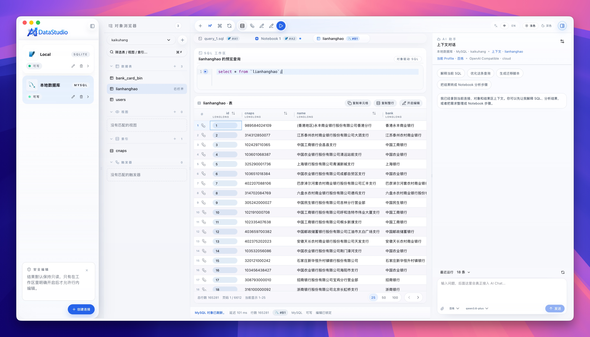
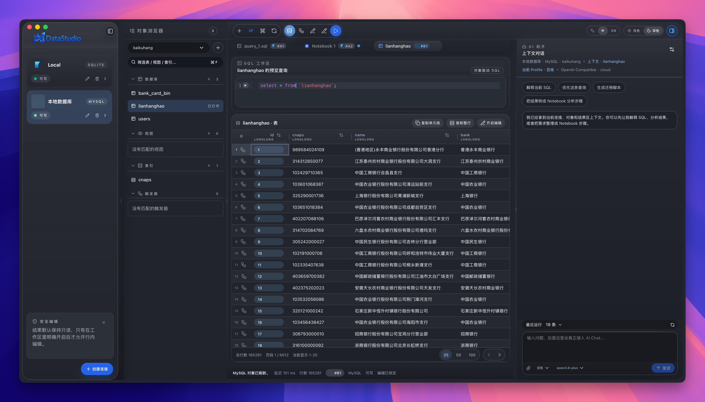
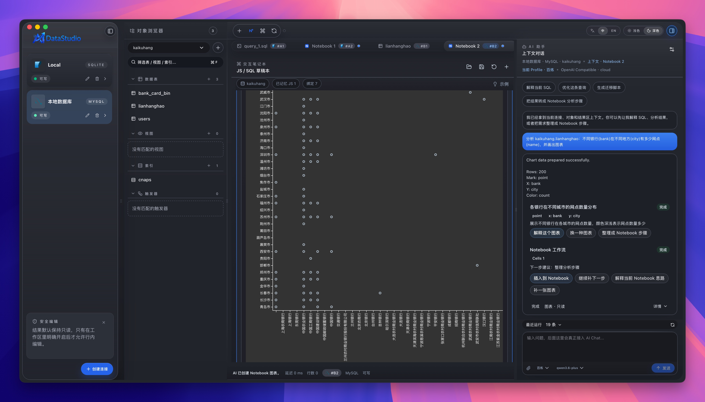
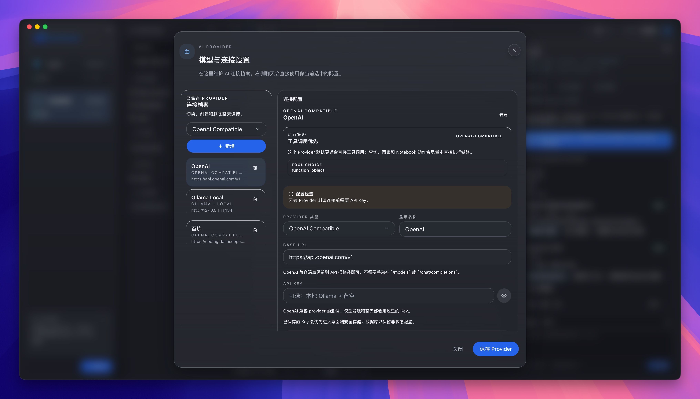

# AIData Studio CI

This repository intentionally contains CI and distribution wiring only. Source
code is fetched from CNB during a manually triggered GitHub Actions run.

## Screenshots

<table>
  <tr>
    <td></td>
    <td></td>
    <td></td>
    <td></td>
  </tr>
</table>

## Installation

### Windows

You can download the installer .exe from GitHub releases.

### macOS

Download the .dmg from GitHub releases.

After copying `AI Data Studio.app` to your Applications folder, you may see the
following error message:

```text
"AI Data Studio.app" is damaged and can't be opened. You should move it to the Bin.
```

This is Apple lying to you. Nothing is "damaged", it's just not code-signed with
an Apple Developer certificate. To fix it, run the following command:

```sh
xattr -rd com.apple.quarantine /Applications/AI\ Data\ Studio.app
```

## Manual Build

Open **Actions -> Build AIData Studio -> Run workflow**, then choose:

- `source_ref`: CNB branch, tag, or commit to build.
- `release_mode`: `unsigned`, `signed`, or `signed-skip-stapling`.
- `target_mode`: `host`, `apple-silicon`, `intel`, `both`, or `universal`.
- `publish_github_release`: upload the DMG/checksums to a GitHub Release.

## Repository Variables

- `CNB_SOURCE_REPO`: source repository URL. Defaults to
  `https://cnb.cool/bullsoft/vtable.git`.
- `VJSX_REPO`: vjsx repository URL. Defaults to
  `https://github.com/guweigang/vjsx.git`.
- `VTABLE_SIDECAR_V_FLAGS`: V compile flags. Defaults to
  `-cc clang -show-c-output -d build_quickjs -d use_openssl`.
- `VTABLE_WINDOWS_SIDECAR_V_FLAGS`: Windows sidecar V compile flags. Defaults
  to `-cc msvc -show-c-output -d build_quickjs`.

QuickJS source preparation is delegated to `vjsx/scripts/ensure-quickjs.sh`.
The workflow exports `VJS_QUICKJS_PATH` for the vtable sidecar build, so this
CI project does not need to know which QuickJS implementation vjsx manages.

## Repository Secrets

- `CNB_ACCESS_TOKEN`: optional CNB access token or deploy token for private CNB
  repositories. CNB uses HTTPS authentication with username `cnb` and this
  token as the password.
- Apple signing/notarization secrets are optional and only needed for signed
  builds: `APPLE_SIGNING_IDENTITY`, `APPLE_CERTIFICATE`,
  `APPLE_CERTIFICATE_PASSWORD`, `APPLE_ID`, `APPLE_PASSWORD`, `APPLE_TEAM_ID`,
  `APPLE_API_KEY`, `APPLE_API_ISSUER`, `APPLE_API_KEY_PATH`, and
  `APPLE_PROVIDER_SHORT_NAME`.

Unsigned host builds should work without Apple signing secrets.
